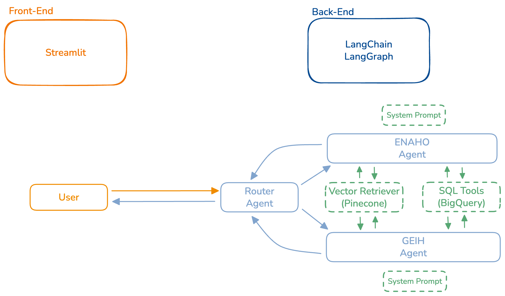

# Equilibrium SQL Multi-Agent

## Project Overview
Chatbot system that can answer complex user questions by querying two separate, complex databases: **ENAHO** and **GEIH**. The system uses AI agents to understand natural language queries and generate appropriate SQL queries.

## Technical Stack
- **Databases**: Google BigQuery
- **AI Framework**: LangChain + LangGraph for agent orchestration
- **LLMs**: Gemini/GPT for agents
- **Embeddings**: VoyageAI (voyage-3.5 model)
- **Vector Database**: Pinecone with separate indexes per database
- **Architecture**: Multi-agent system with separate agents for each database

## Multi-Agent Architecture with LangGraph
- **Multi-Agent Orchestration**: Specialized agents for ENAHO and GEIH databases with intelligent routing

### Linear Flow Diagram
```
User Query → Router Agent → Specialized Agent [ENAHO | GEIH] → Table Selection (System Prompt) → Column Retrieval (Vector DB) → SQL Generation → Execution → Response
```

### ReAct Flow Diagram
```
User Query → Router Agent → Specialized Agent [ENAHO | GEIH] → ReAct Loop → Format Answer Node
                                                                  ↓
                                                        [Table Description Tool]
                                                        [Column Retrieval Tool]
                                                        [SQL Generation Tool]
                                                        [Validation Tool]
                                                        [Execution Tool]
                                                        [Documentation Search Tool]
```



## Agent Design Strategy
- **System Prompt**: Contains table descriptions and business logic for immediate table selection (linar flow)
- **Vector Retrieval**: Query column namespace filtered by selected table(s) for relevant columns
- **Documentation Access**: Specialized agents can query documentation namespace for methodology clarifications
- **Token Management**: Intelligent message trimming and summarization to maintain context while respecting LLM token limits
- **Conversation Persistence**: Long-term memory with conversation threads saved to BigQuery datasets for continuity across sessions

## Current Prototype Limitations
- **Single Universal User**: The application operates with a single user model - no individual user authentication or personalized data management
- **Restricted Access**: Access will be limited to authorized users only, though without individual user account management
- **Prototype Status**: This is a proof-of-concept implementation designed to validate the multi-agent SQL generation approach

## Install in Development Mode

1. Install package in development mode:

```bash
uv pip install -e .
```

2. Verify Installation

```bash
uv pip show esma
uv pip list
uv run python -c "import esma; print('esma imported successfully')"
```
