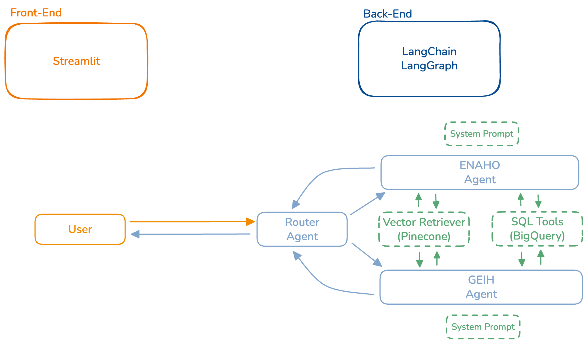

# Equilibrium SQL Multi-Agent

## Project Overview
Chatbot system that can answer complex user questions by querying two separate, complex databases: **ENAHO** and **GEIH**. The system uses AI agents to understand natural language queries and generate appropriate SQL queries.

## Technical Stack
- **Databases**: Google BigQuery
- **AI Framework**: LangChain + LangGraph for agent orchestration
- **LLMs**: Gemini/GPT for agents
- **Embeddings**: VoyageAI (voyage-3.5 model)
- **Vector Database**: Pinecone with separate indexes per database
- **Architecture**: Multi-agent system with separate agents for each database

## Multi-Agent Architecture with LangGraph
- **Multi-Agent Orchestration**: Specialized agents for ENAHO and GEIH databases with intelligent routing

### Linear Flow Diagram
```
User Query → Router Agent → Specialized Agent [ENAHO | GEIH] → Table Selection (System Prompt) → Column Retrieval (Vector DB) → SQL Generation → Execution → Response
```

### ReAct Flow Diagram
```
User Query → Router Agent → Specialized Agent [ENAHO | GEIH] → ReAct Loop → Format Answer Node
                                                                  ↓
                                                        [Table Description Tool]
                                                        [Column Retrieval Tool]
                                                        [SQL Generation Tool]
                                                        [Validation Tool]
                                                        [Execution Tool]
                                                        [Documentation Search Tool]
```



## Agent Design Strategy
- **System Prompt**: Contains table descriptions and business logic for immediate table selection (linar flow)
- **Vector Retrieval**: Query column namespace filtered by selected table(s) for relevant columns
- **Documentation Access**: Specialized agents can query documentation namespace for methodology clarifications
- **Token Management**: Intelligent message trimming and summarization to maintain context while respecting LLM token limits
- **Conversation Persistence**: Long-term memory with conversation threads saved to BigQuery datasets for continuity across sessions

## Current Prototype Limitations
- **Single Universal User**: The application operates with a single user model - no individual user authentication or personalized data management
- **Restricted Access**: Access will be limited to authorized users only, though without individual user account management
- **Prototype Status**: This is a proof-of-concept implementation designed to validate the multi-agent SQL generation approach

## Database Complexity Challenge
- **ENAHO Database**: 11 tables, 20-75 columns per table (~440-660 total columns)
- **GEIH Database**: 8 tables, 20-75 columns per table (~320-480 total columns)
- **Documentation**:
  - ENAHO: Each table has a JSON file with schema and variable information and a brief description of what the table contains
  - GEIH: Each table has a JSON file with schema and variable information and a brief description of what the table contains

### Query Scope
- Users will **rarely need to combine information** from both databases
- Each query typically targets one database or the other
- Simplified architecture: separate agents per database rather than cross-database joins

### Schema Management Strategy
**Problem**: Cannot load all 800-1200+ columns into LLM context efficiently

**Solution**: Hybrid Approach - System Prompt Tables + Vector Retrieval Columns
1. **Table-level selection**: Agent system prompt contains descriptions of all 11 (ENAHO) or 8 (GEIH) tables with business logic
2. **Column-level selection**: Agent queries vector database filtered by selected table(s) to retrieve relevant columns
3. **Fallback strategy**: Ask user for rephrasing/clarification when topic classification fails
4. **Documentation gaps**: Reply "beyond scope" when documentation is unclear/missing

## Knowledge Base Architecture

### Pinecone Indexes and Namespaces
- **enaho-2024** index:
  - `enaho-2024-columns` namespace: Column/variable information with rich metadata
  - `enaho-2024-documentation` namespace: Chunked methodology PDF content (650 tokens/chunk, 75 token overlap)

- **geih-2024** index:
  - `geih-2024-columns` namespace: Column/variable information with rich metadata
  - `geih-2024-documentation` namespace: Chunked methodology PDF content (650 tokens/chunk, 75 token overlap)

### Vector Record Structure

**Column Records:**
```json
{
    "id": "ENAHO01-2024-100_P101",
    "values": [...],  # voyage-3.5 embedding of concatenated text
    "metadata": {
        "table_id": "ENAHO01-2024-100",
        "column_name": "P101",
        "description": "Tipo de vivienda",
        "data_type": "NUMERIC",
        "business_meaning": "Housing type classification",
        "valid_values": {
            "1": "Casa independiente",
            "2": "Departamento en edificio",
            "3": "Vivienda en quinta",
            "4": "Vivienda en casa de vecindad"
        }
    }
}
```

**Documentation Records:**
```json
{
    "id": "enaho_15",
    "values": [...],  # voyage-3.5 embedding of chunk text
    "metadata": {
        "source": "enaho_documentation.pdf"
    }
}
```

### Embedding Text Strategy
- **Columns**: Concatenate column_name, description, business_meaning, and valid_values (if available)
- **Documentation**: 650-token chunks with 75-token overlap for context continuity

## Key Technical Considerations
- **Schema versioning**: Handle missing/unclear documentation gracefully
- **Query validation**: Prevent hallucinated table/column names using retrieved metadata
- **Performance**: Efficient embedding retrieval with table filtering
- **Maintainability**: Design code for easy system update when new databases/agents are added
- **Similarity thresholds**: Implement fallback when vector retrieval confidence is low
- **Conversation Management**: Implement effective message trimming strategies to maintain context continuity
- **Data Persistence**: Design conversation storage schema for efficient retrieval and thread reconstruction

## Future Enhancements (Post-Prototype)
- **Caching Layer**: Redis-like database implementation for query result caching and performance optimization
- **User Authentication**: Individual user accounts with role-based access control and personalized query history
- **Multi-User Architecture**: Separate data spaces, conversation histories, and preferences per authenticated user

## Implementation Timeline

### Data Infrastructure Setup (Week 1)
1. Knowledge base creation ✅
  - Pinecone indexes and namespaces established
  - Vector database populated
2. SQL Databases creation ✅
  - BigQuery Datasets established
  - BigQuery Tables populated

### Specialized Agent Development (Weeks 2-3)
1. Agent System Prompts ✅
  - Draft comprehensive table descriptions and metadata
  - Encode business logic and analytical rules per dataset
2. Vector Retrieval Logic
  - Implement column retrieval with table filtering logic
  - Add semantic search integration for schema-aware lookups
3. Database Connections
  - Connect agents to BigQuery
  - Test query execution on live connections
4. SQL Generation
  - Develop SQL query generation with schema validation
  - Implement guardrails for query correctness and efficiency
  - Add error-handling and self-correction loops

### Router Agent Development & System Testing (Weeks 4-5)
1. Router Agent
  - Implement database selection logic
  - Design routing policies based on query type, keywords, and metadata
  - Add confidence scoring to guide routing decisions
2. Integration with Specialized Agents
  - Connect router with ENAHO and GEIH agents
  - Ensure smooth query passing and response handoff
  - Implement consistency checks across agent outputs
3. Fallback Mechanisms
  - Handle unclear queries and incomplete documentation gracefully
  - Escalate to general-purpose agent or clarification prompts when routing fails
  - Maintain logs of fallback cases for continuous improvement
4. Integration Testing
  - Run end-to-end testing with real queries spanning multiple use cases
  - Evaluate accuracy of routing, SQL generation, and retrieval

### Back-End Deployment (Week 6)
1. Containerize with Docker for portability and scalability
2. Configure environment variables, API keys, and secure access
3. Deploy to a production environment

### Front-End Development and Deployment (Weeks 7-8)
1. Streamlit Front-End
2. Integration Layer
3. Testing & Validation
4. Documentation & Handover